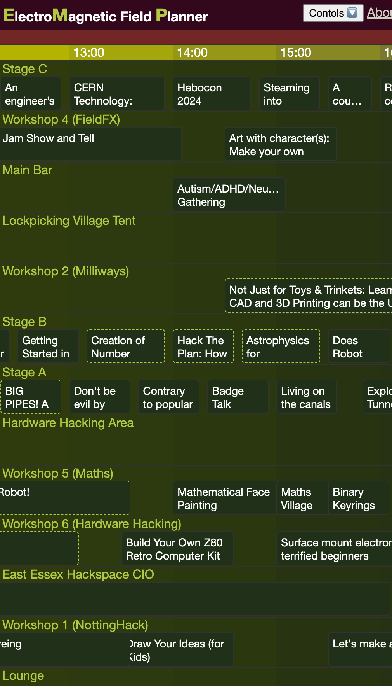

# EMP: ElectroMagnetic Field Planner

A web app to help you plan your time at Electromagnetic Field (EMF Camp), showing the schedule on a 2D timetable.

## Open the planner at [➡️ emp.dave.engineer ⬅️](https://emp.dave.engineer)

The app is unofficial but takes the [official EMF Camp 2024 schedule](https://www.emfcamp.org/schedule/2024)
[API](https://developer.emfcamp.org/schedule/).

You can also load in your favourites from the official site. This is manual but only takes a few seconds.

Status: it works!

Inspired by the
[Teddy Rocks Festival clash finder](https://teddyrocks.co.uk/lineup/clashfinder)
and [bus timetables](https://www.morebus.co.uk/services/WDBC/m2).

## Development

The code is currently vanilla HTML and JavaScript.
It's compiled with WebPack just for cache invalidation.

```bash
npm install
npm run build
cd dist && python3 -m http.server
```

See the issues list for planned features. Contributions welcome.

MIT License. Copyright (c) 2024 Dave Hulbert

## Screenshot


