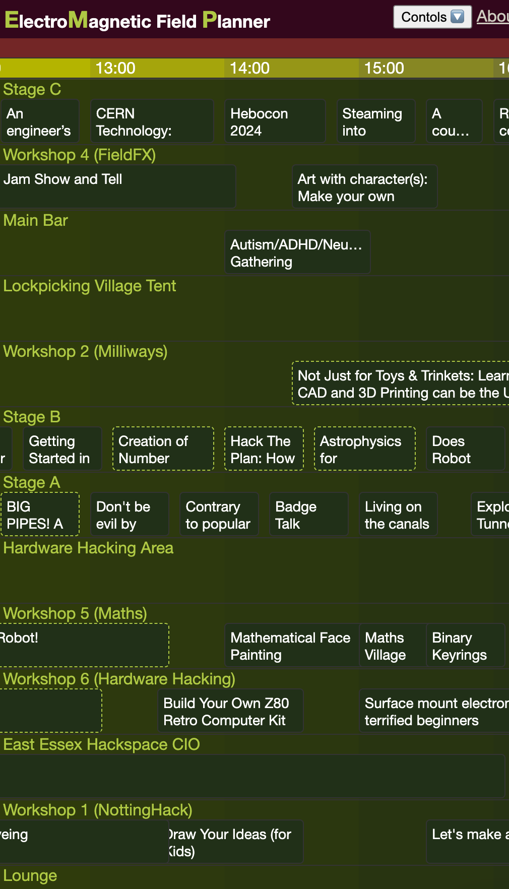

# EMP: ElectroMagnetic Field Planner

A web app to help you plan your time at Electromagnetic Field (EMF Camp), showing the schedule on a 2D timetable.

## Open the planner at [➡️ emp.dave.engineer ⬅️](https://emp.dave.engineer)

The app is unofficial but takes the [official EMF Camp 2024 schedule](https://www.emfcamp.org/schedule/2024)
[API](https://developer.emfcamp.org/schedule/).

You can also load in your favourites from the official site. This is manual but only takes a few seconds.

Status: it works!

Inspired by the
[Teddy Rocks Festival clash finder](https://teddyrocks.co.uk/lineup/clashfinder)
and [bus timetables](https://www.morebus.co.uk/services/WDBC/m2).


## Schedule JSON payload

The planner loads the public EMF schedule JSON, currently from `https://www.emfcamp.org/schedule/2026.json`. The 2026 payload is an array of event objects, and each event can contain one or more scheduled `occurrences`. Older payloads may put `start_date`, `end_date`, and `venue` directly on the event instead; the app supports both shapes.

Top-level event fields currently handled or worth preserving are:

| Field | Description |
| --- | --- |
| `id` | Numeric event identifier. This is also used for favourites, so multiple occurrences of the same event share favourite state. |
| `type` | Content type, such as `performance` or `workshop`. Useful for future filtering or badges. |
| `names` | Speaker, performer, organiser, or host names as display text. |
| `pronouns` | Optional pronoun text for the listed people. |
| `title` | Event title shown on the timeline. |
| `description` | Full event description, often with paragraphs. |
| `short_description` | Short summary suitable for compact displays. |
| `video_privacy` | Recording/streaming privacy setting for the event, such as `public`. |
| `is_fave` | Favourite state from the upstream schedule payload, when provided. The planner currently uses its own imported/local favourites instead. |
| `official_content` | Whether this is official EMF content. |
| `slug` | URL-friendly event slug. |
| `link` | Canonical event page URL. |
| `occurrences` | Array of scheduled instances for the event. Each occurrence is rendered separately on the timeline. |

Occurrence fields currently seen in the 2026 payload are:

| Field | Description |
| --- | --- |
| `occurrence_num` | Sequence number for this occurrence of the parent event. |
| `start_date` | Start date and time, for example `2026-07-17 19:00:00`. |
| `end_date` | End date and time, for example `2026-07-17 20:00:00`. |
| `venue` | Venue name used to group events into timeline rows. |
| `latlon` | Optional `[latitude, longitude]` pair for the venue/location. |
| `map_link` | Optional link to the EMF map at the event location. |
| `uses_lottery` | Whether attendance uses a lottery/ballot process. |
| `video_privacy` | Occurrence-specific recording/streaming privacy setting. |
| `recording_lost` | Whether a recording for this occurrence is unavailable/lost. |
| `start_time` | Display-only start time, such as `19:00`. |
| `end_time` | Display-only end time, such as `20:00`. |

## Development

The code is currently vanilla HTML and JavaScript.
It's compiled with WebPack just for cache invalidation.

```bash
npm install
npm run build
cd dist && python3 -m http.server
```

See the issues list for planned features. Contributions welcome.

MIT License. Copyright (c) 2024 Dave Hulbert

## Screenshot


